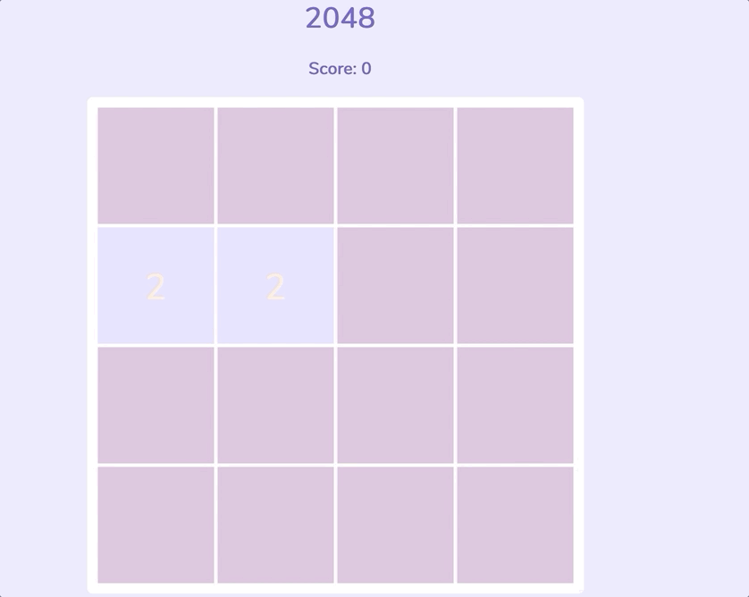

<h1> 2048</h1>

>2048 is a single-player sliding block puzzle game designed by Italian web developer Gabriele Cirulli. The game's objective is to slide numbered tiles on a grid to combine them to >create a tile with the number 2048. However, one can continue to play the game after reaching the goal, creating tiles with larger numbers.
    - From [Wikipedia][wiki-link]

   [wiki-link]: https://en.wikipedia.org/wiki/2048_(video_game) 

This is my attempt at making the 2048 game. 

TODO: Refactor Code  
TODO: Make this project objects all the way down